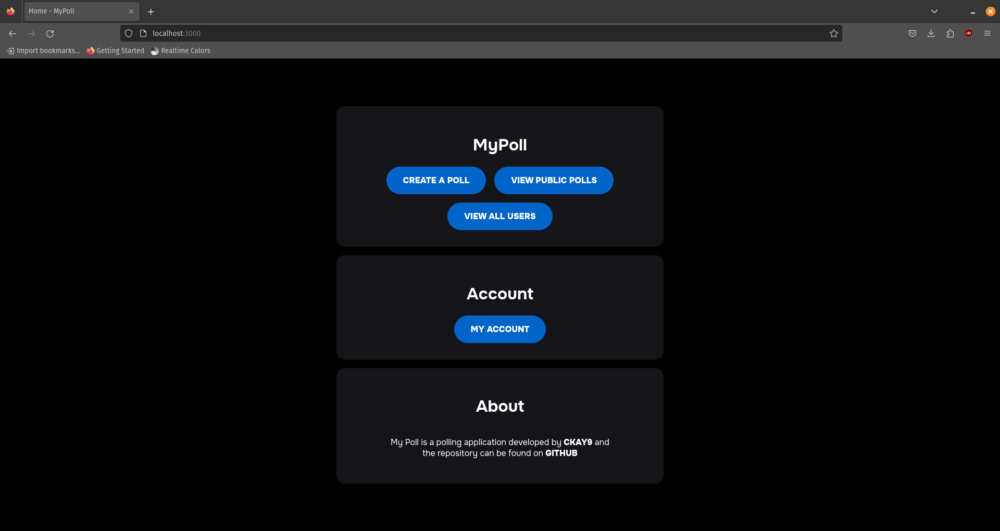
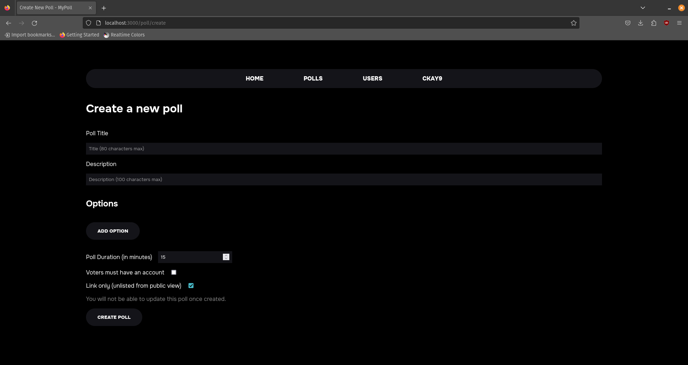
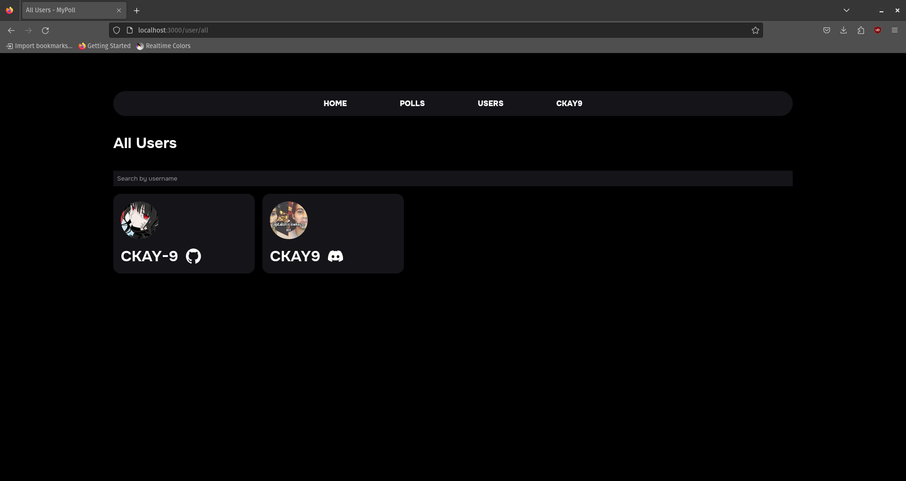
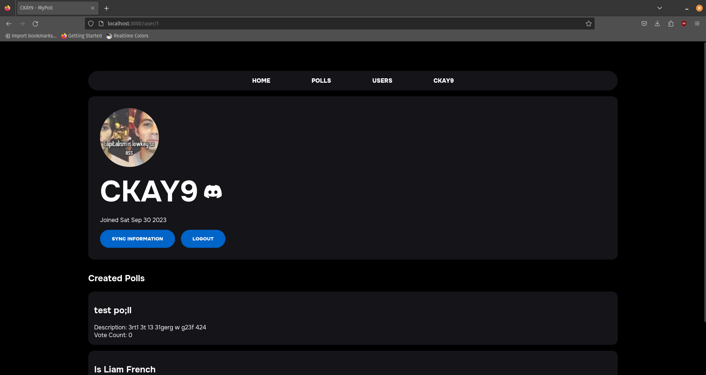
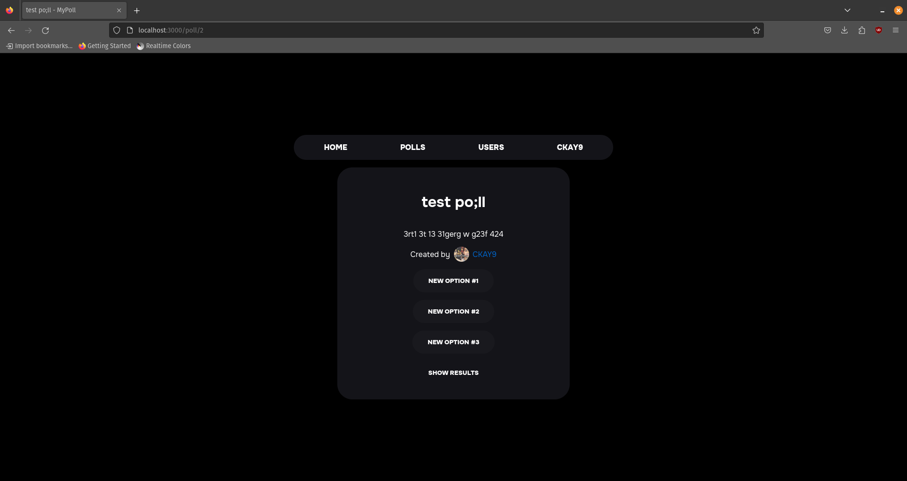
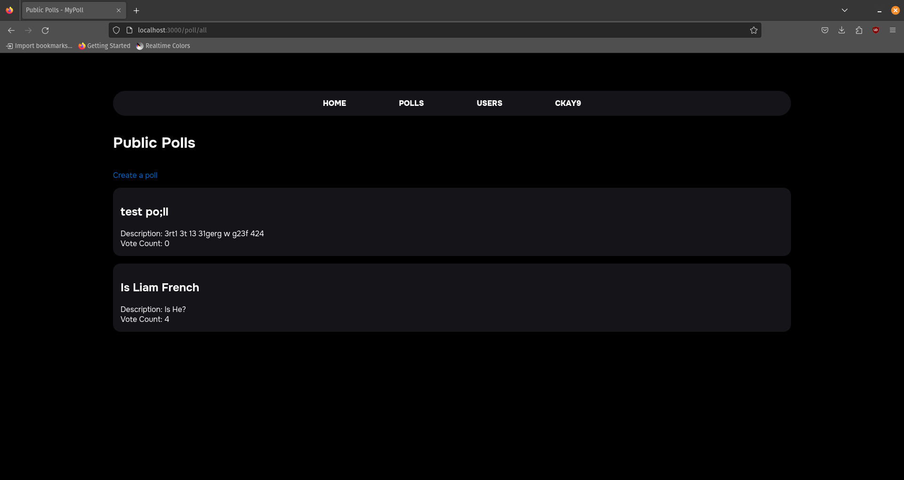

# my-poll

## Showcase

<section style="display: flex; gap: 1rem; flex-wrap: wrap">
    
    
</section>
<section style="display: flex; gap: 1rem; flex-wrap: wrap">
    
    
</section>
<section style="display: flex; gap: 1rem; flex-wrap: wrap">
    
    
</section>
